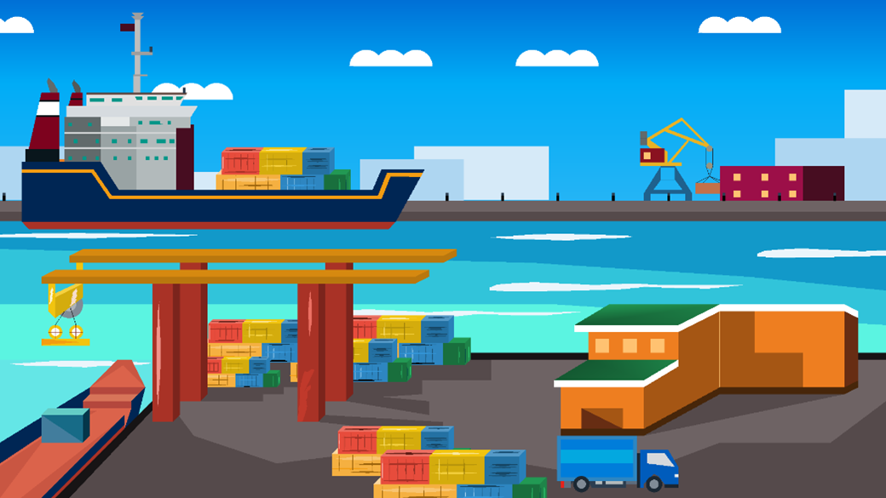
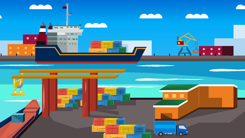
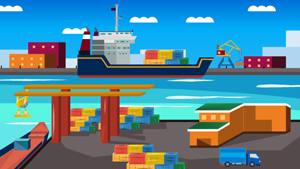
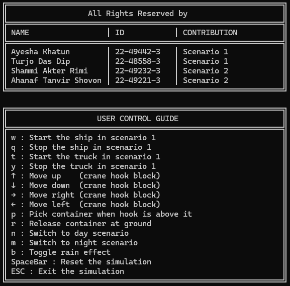

# 🚢 Interactive 2.5D Cargo Port Simulation

An animated real-time simulation of a bustling industrial cargo port — created using **C++** and **OpenGL**. Developed as a part of the **CSC4118 Computer Graphics** course at **AIUB**, this project showcases the core principles of 2.5D graphics, modular animation, and real-time rendering.

> ⚙️ Authors:  
> Ayesha Khatun (22-49442-3)  
> Turjo Das Dip (22-48558-3)  
> Shammi Akter Rimi (22-49232-3)  
> Ahanaf Tanvir Shovon (22-49221-3)

---

## 📷 Simulation Gallery
### Scenario 1: Environment Transitions

| Morning View | Night View |
|--------------|------------|
|  |  |

| Morning with Rain | Night with Rain |
|-------------------|-----------------|
|  |  |

---

### Scenario 2: Alternate Layout

| Morning View | Night View |
|--------------|------------|
|  |  |

| Morning with Rain | Night with Rain |
|-------------------|-----------------|
|  |  |

---

### Dynamic Actions

| Ship Movement | Truck Movement |
|---------------|----------------|
|  |  |

| Container Pickup | Container Release |
|------------------|-------------------|
|  |  |

---

## 📖 User Guide

---

## 🛠️ Technologies Used

- **Language:** C++
- **Graphics API:** OpenGL (Immediate Mode)
- **Framework:** GLUT
- **IDE:** Code::Blocks
- **Platform:** Windows 10
- **Audio:** WAV playback using basic sound libraries

---

## 🌦️ Features

- Real-time simulation of a cargo port
- Modular animation of:
  - Ships
  - Cranes
  - Trucks
  - Containers
- Day and night cycle
- Rain effects with environment lighting
- Multiple scene layouts (Scenario 1 & 2)
- Environmental sounds for realism

---

## 📄 Report

The full project report describing system design, animation techniques, and implementation challenges is available here:  
📘 [`Project Report.pdf`](./Project%20Report.pdf)

---

## 📚 References

- NeHe OpenGL Tutorials: http://nehe.gamedev.net  
- Port Simulator 2012, UIG Entertainment  
- Kilgard, M. J. (1996). *OpenGL Programming for the X Window System*  
- OpenTTD & Transport Tycoon Deluxe Community: https://www.tt-forums.net  

---

> 🎓 Developed as an academic project for **American International University-Bangladesh (AIUB)**  
> Course: Computer Graphics (CSC4118)  
> Instructor: Dipta Justin Gomes
